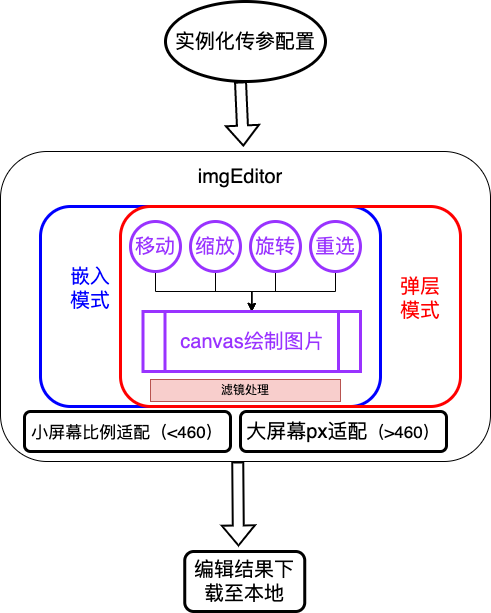

# imgEditor（version1.0）

#### 设计简简介：
基于现在浏览线上图片需求的增涨，很多时候（特别是在网页环境）浏览一张希望获取的图片时，同时又希望在不下载图片至本地的情况下实现简单裁剪编辑，完成编辑后再将结果图片进行下载保存。针对此场景设计了该线上图片编辑器（imgEditor），支持用户直接使用线上图片进行需要的编辑操作，完成编辑后在下载保存图片，直接减少了原有的先下载再裁剪再保存的繁琐操作现状，从原来的“ **三步甚至三步以上** ”的操作缩简至“ **两步** ”，改模块是以jsSDK模式设计，结合了 **单例模式、策略模式、装饰器模式、状态模式等典型的设计模式，结合面向对象的思想设计** ，对外暴露出可以配置API，简单可用，具体架构、配置信息详见README.md内容。

#### 介绍
 **纯js的图片编辑器sdk** 
1. 纯javascript技术实现
2. 支持线上图片资源编辑（旋转、缩放、裁剪、下载）等功能
3. 支持弹层模式、嵌入模式使用
4. 支持自定义场景配置和灵活样式使用
5. 支持自定义切换语言环境
6. 支持自定义配置多样滤镜效果


#### 软件架构




#### 安装教程

1. 先在您需要的html中引入editor.js文件和index.css文件
2. 在您的html准备两个div容器用于承载编辑器主体和工具栏主体，且容器需要有id用于挂件编辑器dom
3. 根据您的需要正确配置您需要的项目，并且实例化编辑器

#### 使用说明
具体配置demo如下：
```
         let options = {
			// 弹窗模式或则嵌入模式
			module: 'dialog1',
			// 主体编辑器容器id
			id: 'editorBox',
			// 编辑器工具容器id
			toolid: 'toolBox',
			// 嵌入模式下自定义编辑器主体宽高（最佳适配比例是2:3）（视口宽>460px生效）
			editorW: 400,
			editorH: 600,
			// 编辑器主体的width（视口宽<460px生效，默认0.9）
			editorProportion: 0.9,
			// 编辑器工具主体的width（视口宽<460px生效，默认0.9）
			// editorToolProportion: 0.6,
			// 编辑器主体宽高比例（视口宽<460px生效，默认2/3）
			editorWH: 2 / 3,
			// 裁剪框尺寸模式 默认模式上default（整个剪裁组件尺寸的0.7)、小尺寸模式samll（整个剪裁组件尺寸的0.4）、大尺寸模式big（整个剪裁组件尺寸的0.9）
			editrBoxModel: 'default',
			// 是否禁用手指拖动功能
			disableTouch: true,
			// 禁用手指拖动功能时自定义步长 单位px
			disableTouchStepLen: 40,
			// 传入的图片
			// uploadImg: 'https://gimg2.baidu.com/image_search/src=http%3A%2F%2Flmg.jj20.com%2Fup%2Fallimg%2F1113%2F061H0105942%2F20061G05942-6-1200.jpg&refer=http%3A%2F%2Flmg.jj20.com&app=2002&size=f9999,10000&q=a80&n=0&g=0n&fmt=jpeg?sec=1646912102&t=f9ada21c8724ba0a36aaafd908f31a23',
			uploadImg: 'https://gimg2.baidu.com/image_search/src=http%3A%2F%2Fc-ssl.duitang.com%2Fuploads%2Fblog%2F202012%2F04%2F20201204182229_e1a0a.thumb.1000_0.jpeg&refer=http%3A%2F%2Fc-ssl.duitang.com&app=2002&size=f9999,10000&q=a80&n=0&g=0n&fmt=jpeg?sec=1638869603&t=0ac37cac7c77e0e7253f4f0c8d6d8851',
			// uploadImg: 'https://gimg2.baidu.com/image_search/src=http%3A%2F%2Fb-ssl.duitang.com%2Fuploads%2Fitem%2F201608%2F12%2F20160812204518_SyX8M.thumb.700_0.jpeg&refer=http%3A%2F%2Fb-ssl.duitang.com&app=2002&size=f9999,10000&q=a80&n=0&g=0n&fmt=jpeg?sec=1638869925&t=47cfa3559bb538068255d6bee03a379a',
			// 渲染页面时触发hook
			onRender: function () { 
				console.log('render....');
			},
			onInit: function () { 
				console.log('init...')
			},
			// 缩放动作发生前触发
			onScale: function () { 
				console.log('onScale...')
			},
			// 撤销动作发生前触发
			onRedo: function () { 
				console.log('onRedo...')
			},
			// 发生节点事件d对应事件触发时触发,可以获取当前事件节点和事件对象
			onClickHook: function () {
				console.log('onClickHook...')
			},
			onMoveHook: function () {
				console.log('onMoveHook...')
			},
			onEndHook: function () {
				console.log('onEndHook...')
			}
		};
		window.mingleSDK && window.mingleSDK.initImgEditor(options);
```


#### 详细说明
    optios参数说明
|  参数 |  值类型 | 说明  |  是否必须 |
|---|---|---|---|
| module |  string |  传入dialog表示弹层模式，否则嵌入模式 |  是 |
|  id |  string |  图片编辑器主体挂在的节点的id，仅嵌入模式下有效，可不传 | 否  |
|  toolid |  string |  图片编辑工具bar挂在的节点的id，仅嵌入模式下有效，可不传 | 否  |
|  editorW |  number |  自定义图片编辑器的宽(仅视口>460px时候该配置生效，最佳适配宽高比是2:3) | 否  |
|  editorH |  number |  自定义图片编辑器的高(仅视口>460px时候该配置生效，最佳适配宽高比是2:3) | 否  |
|  editorProportion |  number |  编辑器主体的width（视口宽<460px生效，默认0.9） | 否  |
|  editorToolProportion |  number |  编辑器工具主体的width（视口宽<460px生效，默认0.9） | 否  |
|  editrBoxModel |  string |  自定义剪裁框尺寸，默认default，可以取值default、small、big | 否  |
|  disableTouch |  boolean |  是否禁用手指拖动功能，默认true | 否  |
|  imgMaxScale |  number |  允许缩放图片的最大值，默认3 | 否  |
|  imgMinScale |  number |  允许缩放图片的最小值，默认0.5 | 否  |
|  editorWH |  number | 编辑器主体宽高比例（视口宽<460px生效，默认2/3适配最优） | 否  |
|  disableTouchStepLen |  number | 禁用手指拖动功能时自定义步长 单位px，默认值30 | 否  |
|  uploadImg |  string | 传入的图片url,现在暂时支持线上url | 是  |

    query参数说明
|  参数 |  值类型 | 说明  |  是否必须 |
|---|---|---|---|
| lang |  string |  语言默认中文（Zh），可以配置英文（En） |  否 |
|  filter |  string |  对编辑后对图片使用滤镜，可以值如下列表 | 否  |
|  editorbox |  number |  可以自定义配置裁剪框尺寸，但最大尺寸不大于默认最大值，最小尺寸不小于默认最小值，否则不生效 | 否  |

    filter滤镜参数值
|  值 |  说明  |  是否必须 |
|---|---|---|
| rv | 图片颜色反转 |  否 |
|  bw | 黑白,可以在query参数中传bwNum参数调整黑白程度，只为number类型 ，例如bwNum=100或bwNum=-100 | 否  |
|  lt | 调节图片亮暗，可以在query参数中传ltNum参数调整亮度，只为number类型，例如ltNum=100或ltNum=-100  | 否  |
| mk | 蒙版， 可以在query参数中传mkType参数决定主色系，只为string类型（值可以是‘r’、‘g’、’b‘），例如mkType='r';可以在query参数中传mkTypeNum参数调整rgb色值，只为string类型（值格式：‘色系_调整值’），例如mkTypeNum=‘r_100’或mkTypeNum=‘r_-100’; | 否  |

    api说明
|  api |  说明  |  |   |
|---|---|---|---|
| onRender |  渲染组件时候触发的回调函数 |  |   |
|  onInit | 初始化阶段触发的回调  |   |   |
|  onScale | 缩放动作发生前触发的回调  |   |   |
|  onRedo | 撤销动作发生前触发的回调  |   |   |
|  onClickHook（e, element） |图片节点click事件事件时触发,可以获取当前事件节点和事件对象  |   |   |
|  onMoveHook（e, element） |图片节点move事件时触发,可以获取当前事件节点和事件对象  |   |   |
|  onEndHook（e, element） |图片节点结束接触时触发,可以获取当前事件节点和事件对象  |   |   |


#### 滤镜效果展示


#### 说明
 _**该jssdk原创，仅学习使用，请勿用于其他用途！欢迎学习交流，作者信息如下：
邮箱：2293188960@qq.com
微信：ZML15372285979**_ 
